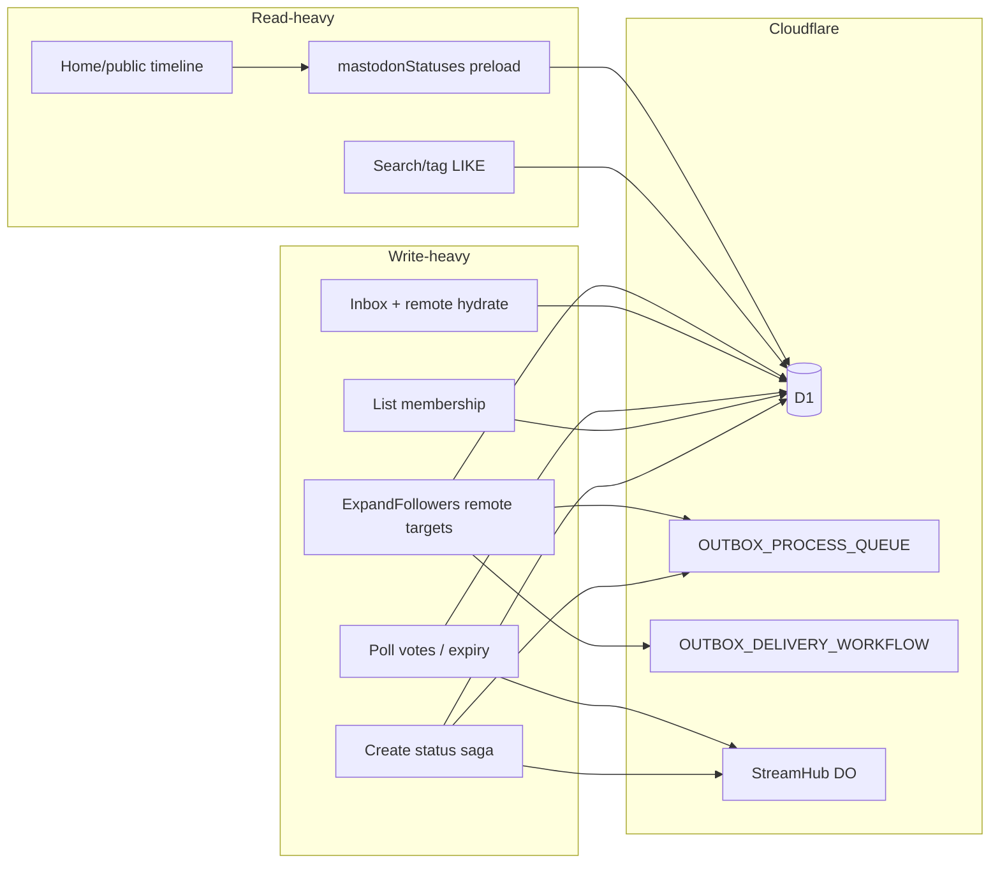

# Heavy D1 Scenarios: Assumptions and Mitigations

| Field          | Value                                                |
| -------------- | ---------------------------------------------------- |
| Author         | tstodon maintainers                                  |
| Date           | 2026-09-23                                           |
| Status         | Draft                                                |
| Audience       | Senior engineers capacity-planning Worker + D1 paths |
| Published path | `docs/architecture/d1-heavy-scenarios.md`            |

## Overview

<!-- constrained-by ./d1-write-strategy.md -->
<!-- constrained-by ./tstodon-architecture.md#cloudflare-mapping -->
<!-- constrained-by ./d1-writes.md -->

This document catalogs **realistic heavy D1 paths** for a Mastodon-compatible Cloudflare Workers server, what the codebase already does to blunt them, and what to do next. It is deliberately scoped to **local / small-instance** operation — not Twitter-scale. Write mechanics (batching, UPSERT, TypedSQL, json_each) are defined in the companion [D1 Write Strategy](./d1-write-strategy.md); this document applies those rules under load.

Every numeric load figure below is labeled **Assumption** unless it cites an in-code constant or helper.

## Background & Motivation

<!-- derived-from ./d1-write-strategy.md#platform-constraints-write-relevant -->

D1 gives tstodon a familiar relational model, but several Mastodon shapes amplify query and write fan-out:

- Timeline pages need N statuses × accounts × counts × media × polls × reblog chains.
- Outbox delivery expands one activity into many **remote** inbox targets.
- Inbox and remote hydrate paths couple HTTP fetch with idempotent inserts.
- Search/tag still use `LIKE '%…%'` scans.
- Cron poll expiry walks a batch of rows and publishes stream events.
- Status Create is a multi-helper saga with partial-failure modes ([Doc A](./d1-write-strategy.md#status-publish-composition-route-level-gap)).

Without explicit assumptions, agents and reviewers over-fit for hyperscale or under-invest in the paths that already hurt small instances (bind limits, writer serialization, N+1 document assembly).

## Goals & Non-Goals

### Goals

- Name the heavy paths with concrete code anchors (`mastodonStatuses`, `ExpandFollowers`, etc.).
- Separate **in-code mitigations** from **proposed next steps**.
- Tie every write-heavy recommendation back to Doc A helpers.
- State load assumptions so capacity talk stays honest.

### Non-Goals

- Guaranteeing multi-region active-active D1.
- Replacing D1 with a different primary store.
- Implementing Vectorize / Workers AI search in this design (architecture notes them as future).
- Full Mastodon parity performance vs. PostgreSQL + Redis Sidekiq deployments.

## Load assumptions (explicit)

| ID  | Assumption / fact                                                                                                                           | Notes                                                                                                               |
| --- | ------------------------------------------------------------------------------------------------------------------------------------------- | ------------------------------------------------------------------------------------------------------------------- |
| A1  | **Assumption:** local / small-instance first                                                                                                | Tens to low hundreds of local accounts; not a global Twitter-class timeline                                         |
| A2  | **Fact:** `queryLimit` defaults to **20** and **clamps to max 40** (`packages/worker/src/http.ts`). **Assumption:** clients usually ask ≤40 | Callers cannot request >40 through this helper                                                                      |
| A3  | **Fact:** reblog/reply depth for document assembly                                                                                          | Code bounds chain resolution to **4 passes** in `mastodonStatuses`                                                  |
| A4  | **Fact:** status context caps                                                                                                               | `CONTEXT_ANCESTOR_LIMIT = 40`, `CONTEXT_DESCENDANT_LIMIT = 60` in `status-store.ts`                                 |
| A5  | **Assumption:** remote followers per local actor                                                                                            | ≤ a few hundred accepted remote followers for early deployments                                                     |
| A6  | **Fact:** list membership edits may exceed 100                                                                                              | Code already chunk-batches at 100                                                                                   |
| A7  | **Fact:** poll expiry cron batch size                                                                                                       | Up to **50** expired unnotified polls per `ProcessExpiredPolls` job                                                 |
| A8  | **Fact:** search default limit                                                                                                              | `queryLimit(..., 5)` on search routes; hashtag/status `LIKE` still full-scan within LIMIT                           |
| A9  | **Fact:** D1 platform                                                                                                                       | 100 bind params; batch soft chunk 100; single-primary write serialization; query duration / Worker CPU limits apply |
| A10 | **Assumption:** not Twitter-scale                                                                                                           | No claim that home timelines of 10k+ followees or celebrity fan-out are in scope without further design             |

If a production target violates A1/A5/A10, revisit fan-out and read models before tuning SQL micro-optimizations.

## Platform limits (reminder)

<!-- constrained-by ./d1-write-strategy.md#platform-constraints-write-relevant -->
<!-- constrained-by ./adr-json-each-membership.md -->

| Limit                          | Code / platform             | Failure mode                                                               |
| ------------------------------ | --------------------------- | -------------------------------------------------------------------------- |
| 100 bound parameters           | `D1_MAX_BOUND_PARAMETERS`   | Statement rejected → Worker 500 (cfwdon)                                   |
| Batch statement soft cap       | `D1_BATCH_CHUNK_SIZE = 100` | Oversized batches should be chunked                                        |
| Single-primary writer          | Cloudflare D1               | Concurrent writers queue; `Promise.all` writes do not parallelize usefully |
| Query duration / Worker limits | Platform                    | Long `LIKE` scans or huge batches risk timeouts                            |
| No interactive transactions    | Platform                    | Use Doc A UPSERT / batch patterns                                          |

## Heavy path catalog



### 1. Home / public timeline pages → `mastodonStatuses`

<!-- constrained-by ./d1-writes.md#timeline--status-document-reads -->

**Shape:** list statuses (`listHomeStatuses` / `listPublicStatuses` / account timelines) then assemble Mastodon JSON for the page. Home timeline SQL already joins accepted `follows` (`status-store.ts`); local followers do **not** need ActivityPub inbox POST for Create visibility.

**Amplifiers:**

- Each `LocalNote` needs account doc, interaction counts, media, optional poll, reply parent account id.
- `LocalReblog` needs the reblog target (and nested reblog) document.
- Naive per-item `mastodonStatus` would be O(N) query storms.

**In code today** (`packages/worker/src/mastodon.ts`):

1. Seed map with page statuses.
2. Up to **4 passes** of `findStatusesByIds` for missing reblog targets / reply parents (`sqlInJsonEach`).
3. Collect account ids, note ids, media ids.
4. `Promise.all` of **reads**: `findAccountsByIds`, `accountCountsByIds`, `statusInteractionCountsByIds`, `findPollsByStatusIds`, `findMediaByIds`.
5. Build documents in memory; `mastodonStatus` delegates to `mastodonStatuses([status])`.

`accountCountsByIds` and `statusInteractionCountsByIds` further use `runD1Batch` + `json_each` aggregates (Doc A read-side batch pattern).

**Risks:**

| Severity | Risk                                                           | Mitigation now       | Next                                                                                                                  |
| -------- | -------------------------------------------------------------- | -------------------- | --------------------------------------------------------------------------------------------------------------------- |
| Med      | Many round-trips still (chain passes + 5 parallel read groups) | Preload + json_each  | **Defer** collapsing five `Promise.all` reads into one `runD1Batch` until metrics exist (see Open Questions #2 / PR5) |
| Med      | Deep reblog chains truncated after 4 passes                    | Hard cap             | Document API behavior; optional 5th pass only if measured                                                             |
| Low      | Partial degrade if one preload fails                           | Maps fall back empty | Surface metrics on preload `RepositoryError`                                                                          |

**A2/A3:** for ≤40 statuses (hard clamp) and shallow reblogs, current preload is the intended design.

### 2. Fan-out: `ExpandFollowers` + many delivery targets

<!-- constrained-by ./tstodon-architecture.md#implemented-surface -->
<!-- constrained-by ./d1-write-strategy.md#3-outbox-activity--fan-out-row -->

**Shape:**

1. `enqueueLocalActivity` inserts activity + fan-out row (**batched**, Doc A) then queues `ExpandFollowers`. Insert/parse failures are **swallowed** today (Doc A operability gap).
2. `processOutboxJob` (`delivery.ts`) **today** still loads local follower ids and builds same-host inbox URLs, then filters them away with `new URL(inbox).host !== sameHost`. **Decided:** **DELETE** that local-follower loop (PR3). Keep only:
   - **Remote** follower inboxes via `listAcceptedRemoteFollowerInboxes` (already coalesces `shared_inbox_uri ?? inbox_uri` into a `Set` — **in code**).
   - Local Create visibility for followers via **home-timeline SQL over `follows`**, not AP inbox POST.
   - `markOutboundExpanded`, then **per remote inbox**: `ensureOutboxTarget` + `startOutboxDeliveryWorkflow` (chunked batching = Doc A PR3).
3. Workflow owns HTTP POST retries (`OUTBOX_DELIVERY_WORKFLOW`).

**In code mitigations:**

- Activity create is a proper Doc A batch.
- Delivery HTTP is off the request path (Queue → Workflow).
- `INSERT OR IGNORE` for targets (`insertOutboxTargetOrIgnore`).
- **Shared-inbox URI coalesce:** `listAcceptedRemoteFollowerInboxes` already dedupes on `shared_inbox_uri ?? inbox_uri`.

**Gaps:**

| Severity | Risk                                                                       | Mitigation now                                                       | Proposed next                                                                                                                                                                |
| -------- | -------------------------------------------------------------------------- | -------------------------------------------------------------------- | ---------------------------------------------------------------------------------------------------------------------------------------------------------------------------- |
| High     | Per-target `ensureOutboxTarget` is sequential `runTyped` + re-read         | Idempotent ignore                                                    | **Chunked `runD1BatchChunked` of target inserts** — implements [Doc A PR3](./d1-write-strategy.md#pr-plan); do not duplicate as a second PR                                  |
| Med      | Local-follower loop does D1 work whose results are same-host-filtered away | Filter works                                                         | **Decided: DELETE** the local-follower inbox construction loop (Doc B PR3); keep remote shared-inbox path only. Do **not** batch `findAccountsByIds` for that discarded path |
| Med      | One queue message expands all remote targets inline                        | Queue isolates publish path                                          | Optional secondary queue / chunked workflow creation if Worker CPU time bites (SLO-driven; see Open Questions)                                                               |
| Low      | Celebrity-scale fan-out                                                    | Shared-inbox coalesce **already in code**; still out of scope at A10 | Caps, secondary queue chunking, followership limits — **not** “add coalescing”                                                                                               |

```mermaid
sequenceDiagram
  participant API
  participant D1
  participant Q as OUTBOX_PROCESS_QUEUE
  participant WF as OUTBOX_DELIVERY_WORKFLOW

  API->>D1: runD1Batch insert activity + fanout row
  API->>Q: ExpandFollowers
  Q->>D1: list remote inboxes shared_inbox coalesce
  Note over Q: local-follower loop deleted; remote shared-inbox path only
  loop per remote inbox today
    Q->>D1: ensureOutboxTarget runTyped
    Q->>WF: create DeliverTarget
  end
  Note over Q,D1: Proposed: batch INSERT OR IGNORE targets in chunks of 100
```

### 3. Inbox bursts / remote status hydrate

**Shape:** ActivityPub inbox accepts signed activities; `insertInboxActivity` uses `INSERT OR IGNORE` on `activity_id`; remote objects hydrate via `persistRemoteObject` (`remote-status-persist.ts`) → fetch (if needed) → `upsertRemoteStatus` (`ON CONFLICT(object_uri)`).

**Amplifiers:**

- Burst of Create/Announce/Follow from many peers.
- Each hydrate may do existence check + HTTP fetch + UPSERT.
- Follow-on writes (notifications, remote favourites/announces) are separate TypedSQL statements with their own conflict keys.

**In code mitigations:**

- Idempotent inserts / `ON CONFLICT` on natural keys — e.g. inbox `activity_id` (`INSERT OR IGNORE`), remote status `object_uri` (UPSERT), remote favourite/announce `(remote_actor_uri, status_id)` (`DO NOTHING` / UPSERT). Do not summarize all of these as “UPSERT on object_uri.”
- DNS/SSRF cache via KV (`REMOTE_DNS_CACHE`) reduces repeat resolution cost (architecture mapping).

**Gaps:**

| Severity | Risk                                            | Mitigation now                | Proposed next                                                             |
| -------- | ----------------------------------------------- | ----------------------------- | ------------------------------------------------------------------------- |
| Med      | Read-then-fetch-then-write race duplicates work | Idempotent natural-key writes | Optional short KV negative/positive cache for object URIs                 |
| Med      | Inbox processing on HTTP request thread         | Current handler path          | Consider queue handoff for expensive hydrate (keep signature verify sync) |
| Low      | Unbounded payload size                          | Platform request limits       | Explicit payload size guard in inbox parse                                |

### 4. Poll expiry cron batch

**Shape:** cron → queue `ProcessExpiredPolls` → `listExpiredUnnotifiedPolls(now, 50)` → per poll: load status, `mastodonStatus`, `publishToAccount` (StreamHub DO), `markPollExpiryNotified`.

**In code mitigations:**

- Hard limit **50** per job (A7).
- Side effects (stream publish) outside the mark write (Doc A rule 4).
- Cron only enqueues; work runs on queue consumer.

**Gaps:**

| Severity | Risk                                                        | Mitigation now           | Proposed next                                                                |
| -------- | ----------------------------------------------------------- | ------------------------ | ---------------------------------------------------------------------------- |
| Med      | Per-poll `mastodonStatus` (preload of 1) + sequential marks | Cap 50                   | Batch-mark notified ids; reuse `mastodonStatuses` for the whole expired page |
| Low      | Backlog if many polls expire same minute                    | Next cron/queue delivery | Loop/enqueue follow-up job while `length === 50`                             |

### 5. Large list membership add/remove

**Shape:** API adds/removes many members → `addListMembers` / `removeListMembers`.

**In code mitigations:**

- `runD1BatchChunked` at 100 (Doc A example).
- `INSERT OR IGNORE` for adds — safe across chunk boundaries.

**Gaps:** low for A6; watch total request CPU if clients send thousands of ids in one call — consider API max members per request.

### 6. Search / tag scans (`LIKE`)

**Shape:**

- `searchStatuses`: `content_text LIKE ?` with `%query%`, `ORDER BY id DESC LIMIT ?`.
- `listTagStatuses`: dual `LIKE` for `#tag` / `#tag.lower`.
- Account search via TypedSQL `searchAccounts` (separate path).
- Search route default limit **5** via `queryLimit(..., 5)`; other list endpoints use `queryLimit` default **20** / max **40** (A2).

**In code mitigations:**

- Strict SQL `LIMIT`.
- Architecture defers Vectorize / Workers AI until local cost is acceptable.

**Gaps:**

| Severity             | Risk                                                  | Mitigation now                 | Proposed next                                            |
| -------------------- | ----------------------------------------------------- | ------------------------------ | -------------------------------------------------------- |
| High (as data grows) | Leading-wildcard `LIKE` cannot use normal B-tree well | LIMIT + small instance (A1/A8) | Hashtag table / FTS5 / Vectorize when A1 no longer holds |
| Med                  | Tag extraction for trending scans content             | Existing helpers               | Materialized tag rows at write time                      |

### 7. Status Create saga (composition)

<!-- constrained-by ./d1-write-strategy.md#status-publish-composition-route-level-gap -->

Covered in depth in Doc A. Heavy-scenario note: under mention fan-out or poll attach, partial failure leaves notify/stream/outbox inconsistent with D1. Treat Create reorder as part of the same reliability workstream as ExpandFollowers batching; **enqueue observability is owned solely by Doc A PR5**, not re-booked here.

## Mitigations matrix

| Technique                                   | Status                        | Where                                                                         |
| ------------------------------------------- | ----------------------------- | ----------------------------------------------------------------------------- |
| `runD1Batch` / `runD1BatchChunked`          | **In code**                   | mentions, status+media, outbox insert, polls, markers, lists, count preloads  |
| UPSERT / OR IGNORE / conditional UPDATE     | **In code**                   | markers, favourites, bookmarks, inbox, outbox targets, remote_*, poll votes   |
| Shared-inbox URI coalesce                   | **In code**                   | `listAcceptedRemoteFollowerInboxes` (`shared_inbox_uri ?? inbox_uri` → `Set`) |
| `sqlInJsonEach` + `jsonStringArray`         | **In code**                   | account/status/media/count membership; `d1-sql.test.ts` regression            |
| TypedSQL fixed statements                   | **In code**                   | `prisma/sql` + `queryTyped`/`runTyped`/`d1PrepareTyped`                       |
| `mastodonStatuses` preload                  | **In code**                   | `mastodon.ts`                                                                 |
| Queue + Workflow fan-out                    | **In code**                   | `ExpandFollowers`, `DeliverTarget`, poll cron enqueue                         |
| StreamHub DO                                | **In code**                   | per-account streaming, not general D1 hot-key locking                         |
| Batch outbox target inserts                 | **Proposed**                  | Doc A PR3 (this doc does not re-own it)                                       |
| Delete local-follower expand loop           | **Decided** (Doc B PR3)       | §2 — remote shared-inbox path only                                            |
| `mastodonStatuses` for poll expiry page     | **Proposed**                  | §4                                                                            |
| Create saga reorder + enqueue observability | **Proposed**                  | Doc A PR5 (sole owner of `enqueueLocalActivity` fix)                          |
| Hashtag/FTS index                           | **Proposed (later)**          | §6                                                                            |
| DO for hot D1 keys                          | **Proposed only if measured** | e.g. single poll row write storms; not default                                |

## Durable Objects vs D1 (boundary)

<!-- constrained-by ./tstodon-architecture.md#cloudflare-mapping -->

| Concern                                                     | Owner                                                                                                           |
| ----------------------------------------------------------- | --------------------------------------------------------------------------------------------------------------- |
| Relational truth (accounts, statuses, follows, outbox rows) | D1                                                                                                              |
| Streaming fan-out to connected clients                      | `StreamHub` Durable Object                                                                                      |
| Outbox HTTP delivery retries                                | Workflows                                                                                                       |
| Hot-key write serialization beyond D1 primary               | **Not implemented**; consider DO only after metrics show a specific row hotspot that batch/UPSERT cannot absorb |

Do not move timeline truth into DO storage as a first response to load.

## Observability for heavy paths

| Path             | What to watch                                                                                              |
| ---------------- | ---------------------------------------------------------------------------------------------------------- |
| Timeline preload | Latency of `mastodonStatuses`; count of chain passes used; preload error rate                              |
| ExpandFollowers  | **Remote** targets per activity; time in expand handler; Workflow create failures                          |
| Outbox enqueue   | Insert/parse/queue-send failures currently silent — fixed by **Doc A PR5** (not a second Doc B change set) |
| Inbox/hydrate    | Idempotent-ignore rate; federated fetch failures                                                           |
| Poll expiry      | Jobs hitting the 50 cap; publish failures                                                                  |
| Search/tag       | p95 query time vs table row counts                                                                         |

Analytics Engine is already wired for cron (`METRICS`); extend blobs/indexes per path rather than inventing a parallel system.

## Security & Privacy Considerations

- Heavy read paths must still enforce visibility (`visibility-guard` / query filters); preload must not skip authz.
- Fan-out must not deliver private/direct payloads to unintended inboxes — filter targets before Workflow create.
- Search `LIKE` reflects only what the query already authorizes (public local notes today for tag/search helpers); do not widen scanned columns carelessly.
- Remote hydrate fetches are SSRF-sensitive — keep using federated-fetch / DNS cache controls.

## Rollout Plan

1. Accept Doc A conventions (no dual write modes); publish both docs with fixed filenames.
2. Land ExpandFollowers **remote** target batching via **Doc A PR3** (single shared code PR).
3. **Delete** the local-follower expand loop (Doc B PR3); land Create saga reorder + enqueue observability via **Doc A PR5** (single `delivery.ts` owner for the swallow gap).
4. Tighten poll expiry to use bulk document assembly + optional continuation job.
5. Add expand-size and search p95 Analytics indexes (Doc B PR5) **after or alongside** Doc A PR5 — without re-implementing enqueue failure instrumentation.
6. Revisit hashtag table / FTS only when search latency or row counts violate A1/A8 comfort.

Rollback for code PRs: revert store/delivery changes; D1 data from `INSERT OR IGNORE` batches remains safe.

## Open Questions

<!-- Leave numeric SLOs / caps / FTS timing unresolved — do not invent values. -->

1. What follower-count / expand-CPU SLO should force **secondary queue chunking or fan-out caps**? (Shared-inbox URI coalesce is already implemented — this question is not about adding coalescing.)
2. Should timeline preload switch from `Promise.all` reads to a single `runD1Batch` for the five aggregates? **Defer until metrics exist** (Doc B PR5): decide only if traces show fewer D1 round-trips or a unified preload `RepositoryError` is worth the change. Not a bikeshed without a success criterion.
3. Hard API max on list member mutation size?
4. When to promote hashtag rows from “proposed later” to scheduled work?

**Resolved elsewhere (not open):** ExpandFollowers local-follower loop is **deleted** (PR3); Doc A adds planned `runTypedBatch` (Doc A PR4).

## Alternatives Considered

### Alternative 1 — Per-user timeline materialization in D1/KV

| Pros          | Cons                                                                       |
| ------------- | -------------------------------------------------------------------------- |
| O(page) reads | Write amplification on every post; complex invalidation; overkill under A1 |

**Defer** until home timeline query cost dominates measured p95.

### Alternative 2 — Move relational hot paths into Durable Objects

| Pros                            | Cons                                             |
| ------------------------------- | ------------------------------------------------ |
| Strong per-key single-threading | Fragments SoT; joins across accounts become hard |

**Reject as default**; keep DO for streaming (and rare measured hot keys).

### Alternative 3 — Synchronous fan-out on the publish request

| Pros                 | Cons                                           |
| -------------------- | ---------------------------------------------- |
| Simpler mental model | Blows request latency/CPU; no Workflow retries |

**Reject** — Queue/Workflow mapping already correct.

### Alternative 4 — Batch `findAccountsByIds` for local followers during ExpandFollowers

| Pros                                  | Cons                                                     |
| ------------------------------------- | -------------------------------------------------------- |
| Fewer round-trips in the current loop | Results are same-host-filtered away; optimizes dead work |

**Reject** — **decided: DELETE** the loop (PR3); keep remote shared-inbox path only.

## References

- [D1 Write Strategy](./d1-write-strategy.md)
- [`./d1-writes.md`](./d1-writes.md)
- [`./tstodon-architecture.md`](./tstodon-architecture.md)
- ADRs: [json_each](./adr-json-each-membership.md), [TypedSQL](./adr-typedsql-d1-execution.md), [migrations SoT](./adr-wrangler-migrations-sot.md), [variable timeline SQL](./adr-variable-timeline-sql.md)
- Code: `mastodon.ts`, `delivery.ts`, `outbox-store.ts`, `status-store.ts`, `social-store.ts`, `poll-store.ts`, `list-store.ts`, `remote-actor-store.ts`, `remote-status-persist.ts`, `scheduled-handler.ts`, `queue-handler.ts`, `stream-hub.ts`, `http.ts`, `routes/statuses.ts`

## Key Decisions

1. **Optimize for local/small-instance assumptions (A1–A10)** — do not design the primary path for Twitter-scale celebrity fan-out; shared-inbox coalesce is already present for remote targets.
2. **`mastodonStatuses` preload is the canonical timeline assembly strategy** — keep it; refine metrics before changing `Promise.all` vs `runD1Batch` for the five read groups.
3. **Fan-out stays Queue + Workflow; D1 only stores activity/target state** — next wins: chunked **remote** target inserts (Doc A PR3) and **DELETE** the local-follower inbox loop (Doc B PR3). Local Create visibility stays on home-timeline SQL over `follows`.
4. **`LIKE` search is acceptable only while A1/A8 hold** — FTS/Vectorize are explicit later work, not silent scope.
5. **Durable Objects are not a generic D1 escape hatch** — StreamHub for streams; hot-key DO only with evidence.
6. **All write-heavy fixes must obey Doc A** — batch, no write `Promise.all`, UPSERT, side effects outside SQL; Create saga gaps are tracked, not ignored.

## PR Plan

| #   | Title                                                          | Primary files                                                                                       | Depends on                           | Description                                                                                                                                                                    |
| --- | -------------------------------------------------------------- | --------------------------------------------------------------------------------------------------- | ------------------------------------ | ------------------------------------------------------------------------------------------------------------------------------------------------------------------------------ |
| 1   | `docs: land heavy D1 scenarios`                                | `docs/architecture/d1-heavy-scenarios.md`, cross-links from `d1-write-strategy.md` + `d1-writes.md` | Doc A PR1 (exact filenames)          | Publish this draft; companion links must use `./d1-write-strategy.md` / `./d1-heavy-scenarios.md` in the same commit pair                                                      |
| 2   | _(no duplicate code PR)_                                       | —                                                                                                   | —                                    | **Implements Doc A PR3** — chunked ExpandFollowers outbox target inserts. Listed here only as a pointer; do not open a second identically titled PR                            |
| 3   | `refactor(worker): delete ExpandFollowers local-follower loop` | `delivery.ts`                                                                                       | May land with or after Doc A PR3     | **Decided.** Delete local-follower inbox construction; keep remote shared-inbox coalesce path only. Same-host filter becomes unnecessary for that removed source.              |
| 4   | `perf(worker): bulk mastodonStatuses in ProcessExpiredPolls`   | `delivery.ts`                                                                                       | —                                    | Assemble up to 50 docs in one preload; optional continuation enqueue                                                                                                           |
| 5   | `chore(worker): metrics for expand size and search latency`    | search routes, Analytics Engine; optional read of Doc A PR5 enqueue signals                         | Doc A PR5 (for enqueue signals only) | Expand-size + search p95 indexes to inform secondary-queue / FTS. **Does not** change `enqueueLocalActivity` / `delivery.ts` for the swallow gap — that is **Doc A PR5 only**. |
| 6   | `feat(worker): hashtag rows or FTS` (later)                    | migrations, status write path, `listTagStatuses`                                                    | PR5 evidence                         | Only when LIKE p95 or row counts demand it                                                                                                                                     |

Create saga reorder **and** `enqueueLocalActivity` observability remain **Doc A PR5** (single owner); this doc references them rather than re-booking `delivery.ts` work.
