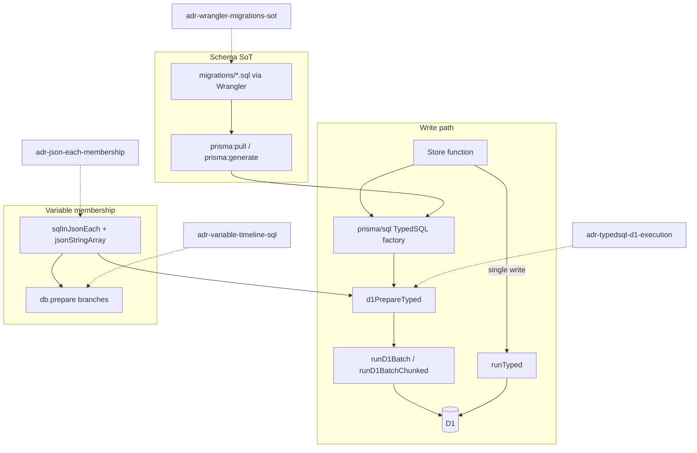
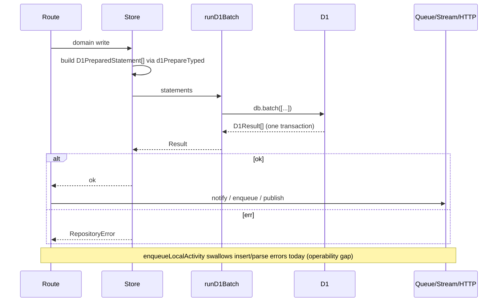

# D1 Write Strategy for tstodon

| Field          | Value                                         |
| -------------- | --------------------------------------------- |
| Author         | tstodon maintainers                           |
| Date           | 2026-09-23                                    |
| Status         | Draft                                         |
| Audience       | Senior engineers working in `packages/worker` |
| Published path | `docs/architecture/d1-write-strategy.md`      |

## Overview

<!-- constrained-by ./tstodon-architecture.md#cloudflare-mapping -->

tstodon persists Mastodon-compatible relational state in Cloudflare D1. D1 is SQLite with a single-primary writer, a hard **100** bound-parameter limit per statement, and `db.batch` as the only practical multi-statement transaction. This document is the long-form design for how Worker stores must write: which helpers to call, how TypedSQL fits, how accepted ADRs constrain membership and schema ownership, and which in-tree store patterns are the reference implementations.

The short checklist remains [`./d1-writes.md`](./d1-writes.md). This design **supersedes that file as the authoritative long-form rationale** while leaving the checklist as the day-to-day review surface (see [Relationship to `d1-writes.md`](#relationship-to-d1-writesmd)). Companion capacity analysis: [`./d1-heavy-scenarios.md`](./d1-heavy-scenarios.md).

## Background & Motivation

<!-- constrained-by ./adr-json-each-membership.md -->
<!-- constrained-by ./adr-typedsql-d1-execution.md -->

### Current state

Worker persistence already clusters around a small helper surface:

| Helper                                       | File                               | Role                                                       |
| -------------------------------------------- | ---------------------------------- | ---------------------------------------------------------- |
| `runD1`                                      | `packages/worker/src/d1.ts`        | Catch D1 failures → `Result<…, RepositoryError>`           |
| `runD1Batch`                                 | same                               | One `db.batch` round-trip / SQL transaction                |
| `runD1BatchChunked`                          | same                               | Chunk large statement lists at `D1_BATCH_CHUNK_SIZE` (100) |
| `sqlInJsonEach` / `jsonStringArray`          | same                               | O(1)-bind membership (`json_each(?)`)                      |
| `d1PrepareTyped` / `queryTyped` / `runTyped` | `packages/worker/src/typed-sql.ts` | Execute Prisma TypedSQL via D1 (`$N` → `?`)                |

Fixed-shape SQL lives under repo-root `prisma/sql/*.sql`, is generated into `packages/worker/src/generated/prisma/sql/`, and is executed only through the TypedSQL helpers. Shape-varying timeline/search/context SQL stays on `db.prepare` ([ADR: variable timeline SQL](./adr-variable-timeline-sql.md)).

### Pain points this design addresses

1. **Writer serialization** — concurrent `Promise.all` of separate D1 writes does not buy parallelism and can amplify contention; `db.batch` is one round-trip and one fate.
2. **Bind-parameter cliffs** — growing `IN (?,?,…)` lists 500 once N > 100 (cfwdon lesson; covered by the json_each ADR).
3. **False transactional expectations** — D1 has no interactive `BEGIN`/`COMMIT`; read-then-write races must be designed out with UPSERT / conditional UPDATE.
4. **Side-effect coupling** — notifications, stream publish, and outbound HTTP must not sit inside a SQL batch whose rollback would leave external systems inconsistent. Route-level sagas that compose several store helpers still need explicit ordering (see [Status publish composition](#status-publish-composition-route-level-gap)).

## Goals & Non-Goals

### Goals

- Make multi-statement write rules explicit enough that store PRs can be reviewed against concrete helpers and examples.
- Keep TypedSQL as codegen-only with D1 execution; keep Wrangler migrations as schema SoT.
- Preserve the short `d1-writes.md` checklist while giving agents and humans the long-form design here.
- Document reference write patterns already in tree (mentions, status+media, outbox+delivery, poll votes, markers, list members, favourites/bookmarks).
- Call out route-level composition gaps that store-level rules alone do not fix.

### Non-Goals

- Introducing a runtime `PrismaClient` / `@prisma/adapter-d1` request path.
- Moving shape-varying timeline SQL into TypedSQL files.
- Claiming Twitter-scale write throughput on a single D1 primary (see companion Doc B).
- Replacing Queues / Workflows / Durable Objects for fan-out and streaming.

## Relationship to `d1-writes.md`

<!-- supersedes ./d1-writes.md -->

| Document                                 | Role                                                                                |
| ---------------------------------------- | ----------------------------------------------------------------------------------- |
| **This design** (`d1-write-strategy.md`) | Long-form write strategy: rationale, diagrams, store examples, PR plan, ADR linkage |
| [`d1-writes.md`](./d1-writes.md)         | Short checklist for authors/reviewers (rules 1–5, pointers to ADRs)                 |

**Policy:** this file is the expanded source of truth for _why_. `d1-writes.md` remains the constrained-by checklist for _what_ (after publish, add `<!-- constrained-by ./d1-write-strategy.md -->` there). When the two disagree, update both in the same PR.

## Relationship to accepted ADRs

<!-- constrained-by ./adr-json-each-membership.md -->
<!-- constrained-by ./adr-typedsql-d1-execution.md -->
<!-- constrained-by ./adr-wrangler-migrations-sot.md -->
<!-- constrained-by ./adr-variable-timeline-sql.md -->



| ADR                                                                | Constraint on writes                                                                                         |
| ------------------------------------------------------------------ | ------------------------------------------------------------------------------------------------------------ |
| [adr-json-each-membership.md](./adr-json-each-membership.md)       | Variable-length id/username sets bind via `json_each(?)`, never growing `IN (?,?,…)`                         |
| [adr-typedsql-d1-execution.md](./adr-typedsql-d1-execution.md)     | Generate with Prisma; execute only via `queryTyped` / `runTyped` / `d1PrepareTyped`; no runtime PrismaClient |
| [adr-wrangler-migrations-sot.md](./adr-wrangler-migrations-sot.md) | Author/apply schema only through Wrangler `migrations/`; regenerate TypedSQL after                           |
| [adr-variable-timeline-sql.md](./adr-variable-timeline-sql.md)     | Shape-varying timeline/search/context SQL stays on `db.prepare`; still must not grow bind lists              |

## Proposed Design

### Platform constraints (write-relevant)

| Constraint               | Value / behavior                                                              | Implication                                                       |
| ------------------------ | ----------------------------------------------------------------------------- | ----------------------------------------------------------------- |
| Bound parameters         | Max **100** per statement (`D1_MAX_BOUND_PARAMETERS`)                         | Membership via `json_each`; fixed-arity TypedSQL stays small      |
| Batch chunk soft cap     | `D1_BATCH_CHUNK_SIZE = 100`                                                   | Homogeneous N-row inserts use `runD1BatchChunked`                 |
| Writer model             | Single primary; statements in a batch run sequentially in one SQL transaction | Prefer batch over `Promise.all` of writes                         |
| Interactive transactions | None                                                                          | Prefer UPSERT / `INSERT OR IGNORE` / conditional `UPDATE … WHERE` |
| Side effects             | Outside SQL (per helper); route sagas need ordering                           | Notify / stream / HTTP after the relevant SQL Result is `ok`      |

### Helper contracts

**Error wrapping**

```ts
// packages/worker/src/d1.ts
export const runD1 = async <T>(work: () => Promise<T>): Promise<Result<T, RepositoryError>>
```

**Atomic multi-statement write**

```ts
export const runD1Batch = (
  db: D1Database,
  statements: ReadonlyArray<D1PreparedStatement>,
): Promise<Result<D1Result[], RepositoryError>>
```

**Large homogeneous batches**

```ts
export const runD1BatchChunked = async (
  db: D1Database,
  statements: ReadonlyArray<D1PreparedStatement>,
  chunkSize: number = D1_BATCH_CHUNK_SIZE,
): Promise<Result<D1Result[], RepositoryError>>
```

Chunks are sequential (`await` per chunk). Partial success across chunks is possible if a later chunk fails — callers that need all-or-nothing across >100 statements must either keep N ≤ chunk size or accept chunk boundaries (list membership today accepts chunk boundaries because each row is independently idempotent via `INSERT OR IGNORE` / delete-by-key).

**TypedSQL → D1**

```ts
// packages/worker/src/typed-sql.ts
export const d1PrepareTyped = (
  db: D1Database,
  typed: { readonly sql: string; readonly values: ReadonlyArray<unknown> },
): D1PreparedStatement =>
  db.prepare(typed.sql.replace(/\$\d+/g, "?")).bind(...(typed.values as unknown[]));

export const queryTyped = async <Row>(db, typed): Promise<Row[]>
export const runTyped = async (db, typed): Promise<D1Result>
```

Rules for callers:

1. Fixed-shape single statements → TypedSQL file + `runTyped` / `queryTyped`.
2. Fixed-shape multi-statement writes → `d1PrepareTyped` × N + `runD1Batch` / `runD1BatchChunked`.
3. Shape-varying SQL → `db.prepare` with fixed bind positions per branch; membership still uses `sqlInJsonEach`.

### Write rules (normative)

1. **Batch multi-statement writes** — parent+children, paired rows, replace-set patterns go through `runD1Batch` / `runD1BatchChunked`, not sequential `await stmt.run()` loops.
2. **No `Promise.all` of D1 writes** on the same database as a substitute for `batch`. Concurrent **reads** via `Promise.all` (as in `mastodonStatuses` preload) are allowed; they still serialize on the primary when they contend with writers.
3. **UPSERT over read-then-write** when app logic allows — `INSERT OR IGNORE`, `ON CONFLICT DO UPDATE`, or conditional `UPDATE … WHERE` with `meta.changes` inspection.
4. **Side effects outside the SQL batch (per store helper)** — `publishToAccount`, queue sends, Workflow creates, and outbound `fetch` must not run inside `runD1Batch`. **Scope:** this rule is normative for each store helper’s batch. Route-level sagas that compose multiple helpers + side effects are a separate ordering problem; the Create status path today does **not** yet satisfy end-to-end “all SQL before all side effects” (see [Status publish composition](#status-publish-composition-route-level-gap)).
5. **Chunk at 100** for large homogeneous statement lists; keep per-statement binds ≪ 100. Patterns that usually stay small (e.g. mentions) may use non-chunked `runD1Batch` only while `statementCount ≤ D1_BATCH_CHUNK_SIZE`; otherwise use `runD1BatchChunked` or an API cap.
6. **Variable membership** always via `sqlInJsonEach()` + `jsonStringArray(...)`.



## Concrete store examples (in tree)

### 1. Mentions — delete-all + insert set in one batch

`replaceStatusMentions` in `packages/worker/src/mention-store.ts`:

- `deleteStatusMentions` + N × `insertStatusMention` (`INSERT OR IGNORE`)
- Single `runD1Batch` today — **safe while `1 + N ≤ ~100`** (typical mention cardinality). If mention sets can approach the soft cap, switch to `runD1BatchChunked` or cap mentions in the API; do not treat unbounded non-chunked batches as normative.

### 2. Status + media — parent note + attachment links

`insertLocalNote` in `packages/worker/src/status-store.ts`:

- `insertLocalNote` TypedSQL + one `attachMediaToStatus` per `mediaIds` entry
- `runD1Batch` so the note never lands without its media links (or neither lands)
- Media count is API-bounded in practice; if that bound ever exceeds ~99 attachments, chunk or reject.

### 3. Outbox activity + fan-out row

`insertOutboundActivity` in `packages/worker/src/outbox-store.ts`:

- Inserts `outbound_activities` + initial `outbox_deliveries` fan-out row (`insertOutboxDeliveryFanout`) in one `runD1Batch`
- Queue `ExpandFollowers` is sent **after** insert succeeds inside `enqueueLocalActivity` (`delivery.ts`)
- **Operability gap:** `enqueueLocalActivity` returns `Promise<void>` and **swallows** `insertOutboundActivity` / `ActivityId.parse` failures (early `return` with no HTTP error and no metric). Callers such as `routes/statuses.ts` cannot tell federation enqueue failed. Track logging/metrics (PR plan).
- Per-inbox targets later use `insertOutboxTargetOrIgnore` via `ensureOutboxTarget` (today sequential; chunked batching is the shared implementation PR with Doc B)

### 4. Poll create and poll votes

**Create** (`insertPoll` in `poll-store.ts`): `insertPoll` TypedSQL + `updateStatusPollId` in one batch (paired write).

**Vote** (`votePoll`):

1. Read poll target (`findPollVoteTarget`) — expiry check in app
2. Build N × `insertPollVoteOrIgnore` + one `updatePollOptionsIfActive` (`UPDATE … WHERE expires_at > ?`)
3. `runD1Batch`; treat final statement `meta.changes === 0` as business “poll expired”

This is the canonical “conditional UPDATE as optimistic concurrency” pattern when a pure UPSERT cannot encode the invariant alone.

### 5. Markers — UPSERT batch

`upsertMarkers` in `marker-store.ts` + `prisma/sql/upsertMarker.sql`:

```sql
INSERT INTO markers (...) VALUES (...)
ON CONFLICT(account_id, timeline) DO UPDATE SET
  last_read_id = excluded.last_read_id,
  version = markers.version + 1,
  updated_at = excluded.updated_at
```

Patches (at most home + notifications) are prepared with `d1PrepareTyped` and committed with `runD1Batch`, then re-read.

### 6. Favourites / bookmarks — single-statement OR IGNORE

`favouriteStatus` / `bookmarkStatus` in `social-store.ts` run TypedSQL `insertFavouriteOrIgnore` / `insertBookmarkOrIgnore` (`INSERT OR IGNORE` on `(account_id, status_id)`). Same UPSERT-over-read-then-write pattern as markers/outbox targets; no multi-statement batch required.

### 7. List membership — chunked homogeneous writes

`addListMembers` / `removeListMembers` in `list-store.ts` use `runD1BatchChunked` over `insertListMember` (`INSERT OR IGNORE`) / `deleteListMember`. This is the reference for “N may exceed 100; each row is independently idempotent.”

### 8. Read-side batch (related, not a write)

`accountCountsByIds` batches three TypedSQL aggregates; `statusInteractionCountsByIds` batches favourites/reblogs/remote counts (+ optional viewer flags). These illustrate `runD1Batch` for multi-shape reads over the same `json_each` id set — complementary to write batching and used by `mastodonStatuses`.

## Status publish composition (route-level gap)

Rule 4 applies **per store helper**. The Create path in `packages/worker/src/routes/statuses.ts` today composes several helpers and side effects in an order that can leave partial outcomes. Heavy-path context (without inventing a reverse dependency): [Doc B §7](./d1-heavy-scenarios.md#7-status-create-saga-composition).

1. `insertLocalNote` (batch: note + media)
2. Optional `insertPoll` (**separate** batch — orphan note if poll insert fails after note ok; route returns 500 but note remains)
3. `notifyAccount` for each mention (**side effect before mentions rows persist**)
4. `replaceStatusMentions`
5. `enqueueLocalActivity` (swallows D1/parse errors — see §3)
6. `publishToAccount` stream update

**Tracked follow-ups (not claimed done):**

| Gap                                   | Severity | Proposed fix                                                                               |
| ------------------------------------- | -------- | ------------------------------------------------------------------------------------------ |
| Notify before `replaceStatusMentions` | Med      | Persist mentions first; then notify                                                        |
| Note + poll not one fate              | Med      | Wider batch (note+media+poll+poll_id) or compensating delete of note if `insertPoll` fails |
| `enqueueLocalActivity` silent failure | Med      | Return `Result` or emit metrics/log; optionally fail the HTTP response                     |

Do not read store-level batch examples as evidence that Create already complies end-to-end.

## API / Interface Changes

No new public Worker HTTP APIs. Internal conventions only:

| Keep                                    | Avoid                                           |
| --------------------------------------- | ----------------------------------------------- |
| `runD1Batch` / `runD1BatchChunked`      | Sequential write loops; `Promise.all` of writes |
| `d1PrepareTyped` + TypedSQL             | Runtime `PrismaClient` / model CRUD             |
| `sqlInJsonEach` + `jsonStringArray`     | Growing `IN (?,?,…)` placeholder maps           |
| UPSERT / OR IGNORE / conditional UPDATE | SELECT-then-INSERT when conflict keys exist     |
| Side effects after helper `ok`          | Mixing HTTP/queue/stream into the SQL batch     |

**Planned helper:** `runTypedBatch(db, typed[])` wrapping `d1PrepareTyped` + `runD1Batch` (Doc A PR4). Land soon; may ship with or after ExpandFollowers target batching (PR3). PR3 does **not** hard-depend on PR4.

## Data Model Changes

None required for the write strategy itself. Schema continues to land via Wrangler migrations ([adr-wrangler-migrations-sot](./adr-wrangler-migrations-sot.md)). When adding tables that participate in multi-statement writes, define conflict keys early so UPSERT/`OR IGNORE` is available.

## Alternatives Considered

### Alternative 1 — Runtime PrismaClient + `$queryRawTyped`

| Pros                     | Cons                                                                                |
| ------------------------ | ----------------------------------------------------------------------------------- |
| “Official” TypedSQL path | `$1` vs `?` footguns on D1; large WASM bundle; no real multi-statement transactions |

**Rejected** — already decided in adr-typedsql-d1-execution; this design inherits that decision.

### Alternative 2 — Always sequential `await runTyped` for simplicity

| Pros                   | Cons                                                                             |
| ---------------------- | -------------------------------------------------------------------------------- |
| Easier to read locally | Multi-round-trip; no shared fate for parent+child; worse under writer contention |

**Rejected** for multi-statement domain writes; allowed only for true single-statement mutations.

### Alternative 3 — Application-level distributed locks / DO-per-row for all writes

| Pros                                | Cons                                                                      |
| ----------------------------------- | ------------------------------------------------------------------------- |
| Stronger serialization for hot keys | Heavy operational surface; premature for local/small-instance assumptions |

**Deferred** — Durable Objects remain for `StreamHub` streaming; Doc B discusses DO for hot keys only if measured contention demands it.

### Alternative 4 — Temp tables for membership instead of `json_each`

| Pros                    | Cons                                                                  |
| ----------------------- | --------------------------------------------------------------------- |
| Familiar SQL join shape | Extra statements/lifecycle for every read; heavier than one JSON bind |

**Rejected** for membership — adr-json-each-membership.

## Security & Privacy Considerations

| Topic               | Notes                                                                                                                                      |
| ------------------- | ------------------------------------------------------------------------------------------------------------------------------------------ |
| SQL injection       | Parameterized `prepare`/`bind` only; TypedSQL factories and `db.prepare` branches must not string-concatenate user text into SQL           |
| `json_each` payload | `jsonStringArray` JSON-encodes values; still treat contents as data, not identifiers for dynamic SQL                                       |
| Batch atomicity     | Failed batches roll back SQL; ensure authz checks happen **before** building statements so unauthorized callers never enqueue side effects |
| Route saga ordering | Authz-before-write is necessary but not sufficient when notify runs before related rows exist (Create mentions)                            |
| Secrets             | Private keys and Access material stay out of D1 write payloads except intentional account key columns already in schema                    |

## Observability

| Signal                   | Current / proposed                                                                                                                            |
| ------------------------ | --------------------------------------------------------------------------------------------------------------------------------------------- |
| Cron enqueue             | `METRICS.writeDataPoint` in `scheduled-handler.ts`                                                                                            |
| Workflow create failures | Structured `console.error` JSON (`OutboxWorkflowCreateFailed`)                                                                                |
| Repository errors        | Mapped at Hono boundary via `RepositoryError` when the route awaits a `Result`                                                                |
| Outbox enqueue swallow   | **Gap:** `enqueueLocalActivity` failures are silent — add log/metric on insert/parse/queue send failure                                       |
| Proposed                 | Count `RepositoryError` by store operation; track batch size histograms for list/outbox paths; alert on repeated D1 timeout/overflow messages |

## Rollout Plan

1. **Docs first** — publish as `docs/architecture/d1-write-strategy.md` + sync `d1-writes.md` checklist pointer.
2. **Review gate** — reject PRs that reintroduce growing `IN` binds or `Promise.all` of **writes** (membership covered by `d1-sql.test.ts`).
3. **No feature flag** — conventions apply to all Worker D1 writes; there is no dual path to flag.
4. **Follow-up code** — ExpandFollowers remote target batching + **delete** local-follower loop (Doc B); `runTypedBatch` (PR4); Create saga reorder; enqueue observability.
5. **Rollback** — documentation/process only for the docs PRs; code PRs revert independently.

## Open Questions

1. **Resolved:** Delete the ExpandFollowers local-follower inbox loop; keep the remote shared-inbox path only (see Doc B PR3). Local Create visibility remains home-timeline SQL over `follows`.
2. **Resolved:** Add `runTypedBatch` soon (PR4 is planned, not optional). May land with or after PR3; PR3 does not hard-depend on it.
3. **Resolved for publish:** filenames are `d1-write-strategy.md` and `d1-heavy-scenarios.md` under `docs/architecture/`.

No further open questions in this document; capacity SLOs remain in Doc B.

## References

- [`./d1-writes.md`](./d1-writes.md) — short checklist (long-form rationale superseded by this doc)
- [`./d1-heavy-scenarios.md`](./d1-heavy-scenarios.md) — companion capacity / heavy-path design
- [`./prisma-typedsql.md`](./prisma-typedsql.md)
- [`./adr-json-each-membership.md`](./adr-json-each-membership.md)
- [`./adr-typedsql-d1-execution.md`](./adr-typedsql-d1-execution.md)
- [`./adr-wrangler-migrations-sot.md`](./adr-wrangler-migrations-sot.md)
- [`./adr-variable-timeline-sql.md`](./adr-variable-timeline-sql.md)
- [`./tstodon-architecture.md`](./tstodon-architecture.md)
- Code: `packages/worker/src/d1.ts`, `typed-sql.ts`, `mention-store.ts`, `status-store.ts`, `outbox-store.ts`, `poll-store.ts`, `marker-store.ts`, `list-store.ts`, `social-store.ts`, `delivery.ts`, `routes/statuses.ts`

## Key Decisions

1. **`db.batch` is the write transaction** — multi-statement domain writes use `runD1Batch` / `runD1BatchChunked`; D1 has no interactive transactions.
2. **TypedSQL is codegen-only; D1 helpers execute** — inherits adr-typedsql-d1-execution; stores must not grow a PrismaClient path.
3. **UPSERT / conditional UPDATE beat read-then-write** — markers, outbox targets, poll expiry races; also favourites/bookmarks via store APIs `favouriteStatus` / `bookmarkStatus` (`social-store.ts`) backing onto TypedSQL `insertFavouriteOrIgnore` / `insertBookmarkOrIgnore`.
4. **Side effects stay outside each SQL batch; route sagas need their own ordering** — store helpers must not mix HTTP/queue/stream into `runD1Batch`; Create path composition is a tracked gap, not claimed compliant.
5. **This design is the long-form SoT; `d1-writes.md` remains the short checklist** — explicit supersede relationship; checklist will be `constrained-by` this file after publish.
6. **Variable membership is orthogonal but mandatory** — json_each ADR applies to any write or read that filters by id sets.
7. **Published filenames are fixed** — `d1-write-strategy.md` + `d1-heavy-scenarios.md`.
8. **`runTypedBatch` is planned** — land soon (PR4); reduces `d1PrepareTyped` + `runD1Batch` boilerplate.
9. **ExpandFollowers local-follower loop will be deleted** — remote shared-inbox path only (Doc B PR3).

## PR Plan

| #   | Title                                                              | Primary files                                                              | Depends on             | Description                                                                                                                                                                                                                                        |
| --- | ------------------------------------------------------------------ | -------------------------------------------------------------------------- | ---------------------- | -------------------------------------------------------------------------------------------------------------------------------------------------------------------------------------------------------------------------------------------------- |
| 1   | `docs: land D1 write strategy`                                     | `docs/architecture/d1-write-strategy.md`, `docs/architecture/d1-writes.md` | —                      | Publish this draft; add `constrained-by ./d1-write-strategy.md` on the checklist; cross-link ADRs                                                                                                                                                  |
| 2   | `docs: point architecture index at write strategy`                 | `docs/architecture/tstodon-architecture.md`                                | PR1                    | Cloudflare mapping row: link long-form + checklist                                                                                                                                                                                                 |
| 3   | `refactor(worker): chunked ExpandFollowers outbox target inserts`  | `packages/worker/src/delivery.ts`, `outbox-store.ts`                       | PR1 (convention only)  | **Shared implementation PR** (Doc B references this id). Replace per-inbox sequential `ensureOutboxTarget` with chunked `INSERT OR IGNORE` batch + workflow starts. May land before or with PR4; does not hard-depend on `runTypedBatch`.          |
| 4   | `refactor(worker): add runTypedBatch helper`                       | `packages/worker/src/typed-sql.ts`, call sites as convenient               | PR1                    | **Planned (not optional).** Sugar over `d1PrepareTyped` + `runD1Batch`. Land soon; may ship with or after PR3.                                                                                                                                     |
| 5   | `fix(worker): Create status saga ordering + enqueue observability` | `routes/statuses.ts`, `delivery.ts`                                        | PR1                    | **Sole owner** of `enqueueLocalActivity` swallow fix (`Result` and/or log/metric on insert/parse/queue send). Also: persist mentions before notify; handle note/poll fate. Doc B must not open a second `delivery.ts` change set for the same gap. |
| 6   | _(deferred)_ Write-side `Promise.all` guard                        | —                                                                          | evidence of regression | Do **not** land a blunt lint forbidding `Promise.all` near stores — it false-positives `mastodonStatuses` reads. Revisit only with a write-helper-scoped check if a real write regression appears; rely on checklist + `d1-sql.test.ts` for now    |
